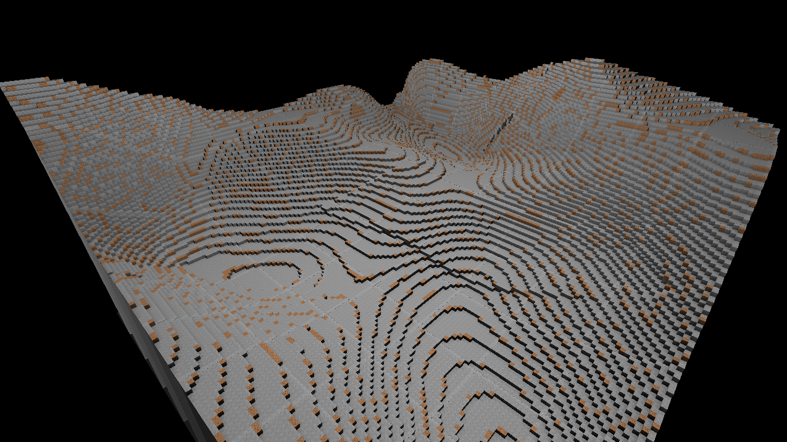

# Rustcraft
A FOSS Minecraft clone written in the best programming language (aka Rust)



## About

I started this project right when I was starting to learn Rust. Since I
already knew OpenGL, I used it as a vehicle for my learning experience. 
Lately, I came to this again since it was already in an advanced enough state
in order to experiment with some stuff.

However, the code was the Rust equivalent of _spaghetti code_. Since I was
only learning when I started it, whenever I had a `cannot move out of borrowed
context` I randomly threw `Cell`, `RefCell`, `Arc` and `Box` ad nauseam until
it magically worked. The `oxidation` commits I did in the past weeks fix a few
of these abominations.

My last experiments were with the world generator. The current code uses a
version of the noise-based generator described in the first chapter of the GPU
Gems 3 book. 

The rendering code needs some refactoring to improve efficiency and to fix
some glitches (such as the occlusion errors in the chunk borders).

Some time in the future, I will migrate everything to Vulkan and change the
name to Obsidian Oxide.

For now, read this project as an experimental fun thingy. Here be dragons!

## Compiling
To run Rustcraft, you'll need a nightly version of rustc and Cargo. If you don't know how to do this, 
rustup is your best friend!

After installing the toolchain, clone this repo, change to its directory, and then type:
```bash
$ cargo build
# And to run,
$ cargo run
```

## Features
- [x] Basic world generator
- [x] Basic blocks
- [ ] World editing
- [ ] Ambient Occlusion (WIP)
- [ ] Simple multiplayer
- [ ] Inventory system
- [ ] Day/night cycle
- [ ] Survival mode
